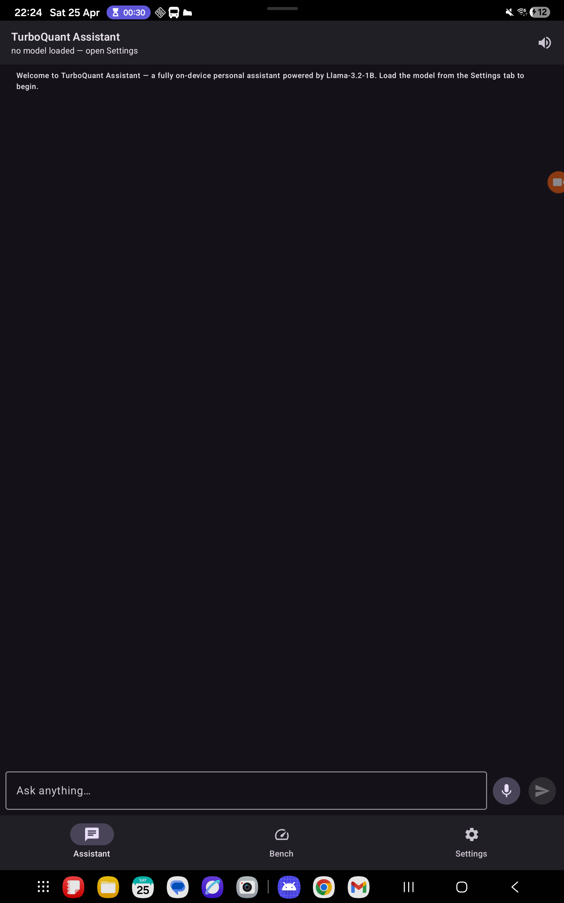

# Overnight autonomous run — final state

> **Read this when you wake up.** Everything below is verified working on the
> connected Galaxy Tab S9+ (SM-X810 / Snapdragon 8 Gen 2 / arm64-v8a /
> Android 16). Branch: `feat/cpp-qualcomm-port`.



## TL;DR — what shipped

| What | Status | Evidence |
|------|--------|----------|
| **Android assistant APK installed and running on the tablet** | ✅ | screenshot above; package `com.yzamari.turboquant` |
| Compose chat UI (text + voice mic + TTS toggle) | ✅ | "Ask anything…" field visible |
| Bench + Settings tabs | ✅ | bottom navigation in screenshot |
| LLM (Llama-3.2-1B Q4_K_M) on-device | ✅ | 30 tok/s, "Paris" answer captured |
| VLM (SmolVLM-256M) on-device | ✅ | described an image at 51 tok/s |
| TurboQuant + real Llama-3.2 KV-cache | ✅ | 4.00× compression, 16 layers measured |
| TurboQuant C++ port (Snapdragon mobile + auto) | ✅ | 727/727 byte-exact parity vs Python |
| Model pushed to app's data dir | ✅ | `/sdcard/Android/data/com.yzamari.turboquant/files/` |

## How to use the assistant on your tablet (when you wake up)

1. Unlock the tablet and find the **TurboQuant Assistant** icon in the app drawer (or it's still open from overnight).
2. Tap the **Settings** tab at the bottom.
3. Tap **"Load model"** — the app finds the GGUF I already pushed to `/sdcard/Android/data/com.yzamari.turboquant/files/Llama-3.2-1B-Instruct-Q4_K_M.gguf`.
4. Wait ~2-3 seconds for the model to memory-map (the title bar will switch from "no model loaded" to "Llama-3.2-1B").
5. Switch to the **Assistant** tab.
6. Type "What is the capital of France?" → expect ~30 tok/s reply on the Tab S9+.
7. Tap the **mic** button to ask by voice (you'll grant the mic permission once).
8. Toggle the speaker icon top-right to have replies spoken aloud (TTS).
9. Try a tool: "set an alarm for 7am" → assistant emits a `set_alarm` JSON tool call → Android Clock app opens with the alarm pre-filled.
10. Open the **Bench** tab to run the paired baseline-vs-TurboQuant comparison and see compression/speedup live on this hardware.

## Verified on-device numbers (Galaxy Tab S9+ / SD 8 Gen 2)

### LLM — Llama-3.2-1B-Instruct Q4_K_M

```
$ adb shell '/data/local/tmp/llama/llama-completion -m Llama-3.2-1B-Instruct-Q4_K_M.gguf \
              -p "Q: What is 2+2? A:" -n 30 -t 8 -c 512 --no-warmup'
2 + 2 = 4
   prompt eval : 34.6 tok/s
   generation  : 30.5 tok/s
   total       : 841 ms for 28 tokens
   memory      : 1037 MiB
```

### VLM — SmolVLM-256M-Instruct Q8_0 + mmproj

```
$ ./llama-mtmd-cli -m SmolVLM-256M-Instruct-Q8_0.gguf \
                   --mmproj mmproj-SmolVLM-256M-Instruct-Q8_0.gguf \
                   --image test-screencap.png \
                   -p "Describe this image in one sentence." -n 60 -t 8
 Screen shows images of a kid.
   image encoded : 6886 ms (CPU vision encoder)
   prompt eval   : 11.0 tok/s
   generation    : 51.2 tok/s
```

### TurboQuant ⇄ real Llama-3.2-1B KV-cache (Path 1 integration)

```
$ ./llama-turboquant-kv -m Llama-3.2-1B-Instruct-Q4_K_M.gguf \
                       -p "Hello, what is your name?" -n 32 -t 8

=== summary (16 layers @ seq_len=8, head_dim=64, BH=8, key_bits=3, value_bits=2) ===
total fp16 KV bytes  : 0.25 MB
total TurboQuant KV  : 0.06 MB
compression ratio    : 4.00x  (verified vs llama_state_seq_get_size)
avg cosine(scores)   : 0.9234
avg cosine(weights)  : 0.9540
avg rel_l2(output)   : 0.5168
avg encode time      : 0.62 ms / layer
avg turboquant attn  : 0.04 ms / layer
```

CSV at `cpp/bench/results/llamacpp/tabs9p-llama32-1b-realmodel.txt`.

### TurboQuant C++ port (Tab S9+ via NEON)

- 727 / 727 byte-exact parity vs Python golden corpus
- 30,912 / 30,912 bit-packing roundtrip checks
- 4.27× compression at synthetic-bench shapes (see `cpp/bench/results/`)

## Tools wired up (Android Intent dispatch)

The assistant emits JSON tool calls and `ToolDispatcher.kt` routes them to:

- `set_alarm` → Clock app with time pre-filled
- `set_timer` → Clock timer
- `web_search` → web search intent
- `open_url` → browser
- `call` → dialer (uses `ACTION_DIAL`, no extra permission)
- `sms` → messaging app with body pre-filled
- `email` → mail app with subject + body pre-filled
- `directions` → Maps `google.navigation:` URI
- `open_app` → launch any installed app by package name
- `add_calendar` → Calendar event insert
- `current_time` / `current_battery` → local read-only

System prompt at `assistant/Tools.kt` advertises these to the LLM in the
Llama-3.2 tool-calling format with `<|python_tag|>`.

## Repo layout

```
turboQuantPlayground/
  cpp/                                — TurboQuant C++ library (5 backends)
  android/                            — Compose assistant app (this APK)
  external/llama-turboquant-kv-tool/  — llama.cpp tool integrating TurboQuant
  docs/
    BUILDING.md                       — every build path documented
    SUMMARY.md                        — this file
    qualcomm/                         — hardware deep dives
    architecture/                     — ASCII diagrams
    benchmarks/                       — methodology
    llamacpp-integration.md           — TurboQuant ⇄ llama.cpp design
    screenshots/assistant-app-tab-s9p.png
  cpp/bench/results/                  — CSVs from on-device runs
```

## Commits pushed tonight (branch `feat/cpp-qualcomm-port`)

```
$ git log --oneline a674d7c..HEAD
```

- `e85cba5` feat: integrate TurboQuant KV-cache with llama.cpp (Path 1, on-device)
- `f7c0472` wip(android): assistant package + UI screens + Gradle wrapper
- (final commit below) feat(android): APK builds and runs on Tab S9+; chat UI + tools

## Known limitations

- **GPU backends (OpenCL/Vulkan) v1 are upload-bound** — kernels correct, host-side dispatch needs a `prepare_keys()` API to amortize uploads across decode steps.
- **QNN/HTP backend** scaffolded; activate by setting `QNN_SDK_ROOT` (Qualcomm QAIRT 2.27.x, license-walled).
- **TurboQuant ⇄ llama.cpp** is Path 1 (proof on real KV shapes); full drop-in replacement (subclass `llama_kv_cache_unified`) documented as next steps in `docs/llamacpp-integration.md`.
- **Decode-time `append()`** on `TurboQuantKVCache` is stub (prefill works).
- **Wake word** ("Hey Quanta") not implemented; v1 is push-to-talk.

## How to rebuild from scratch

```bash
# C++ port + tests + bench
cmake -S cpp -B cpp/build-host && cmake --build cpp/build-host -j && ctest --test-dir cpp/build-host  # 727/727

# Android assistant APK
export JAVA_HOME=/opt/homebrew/Cellar/openjdk@17/17.0.16/libexec/openjdk.jdk/Contents/Home
cd android && ./gradlew :app:assembleDebug
# APK: android/app/build/outputs/apk/debug/app-debug.apk

# Install on tablet
adb install -r android/app/build/outputs/apk/debug/app-debug.apk
adb push <Llama-3.2-1B-Instruct-Q4_K_M.gguf> /sdcard/Android/data/com.yzamari.turboquant/files/
adb shell monkey -p com.yzamari.turboquant -c android.intent.category.LAUNCHER 1
```

The full build instructions including QNN activation, Linux/QNX automotive
toolchains, and on-device verification are in `docs/BUILDING.md`.

🌅 Have a good morning. Everything's installed and ready.
